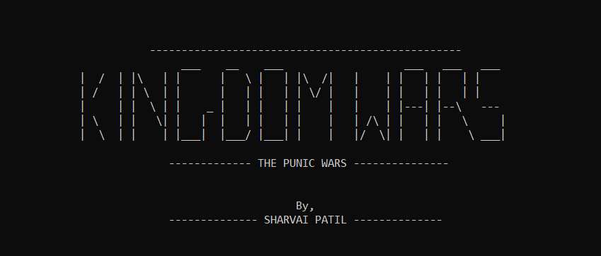
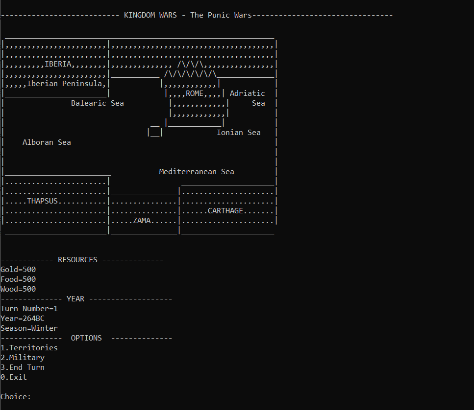
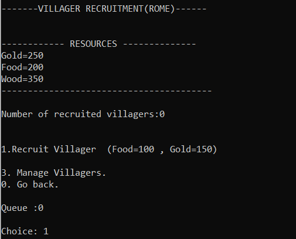
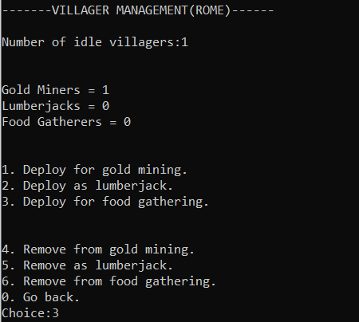
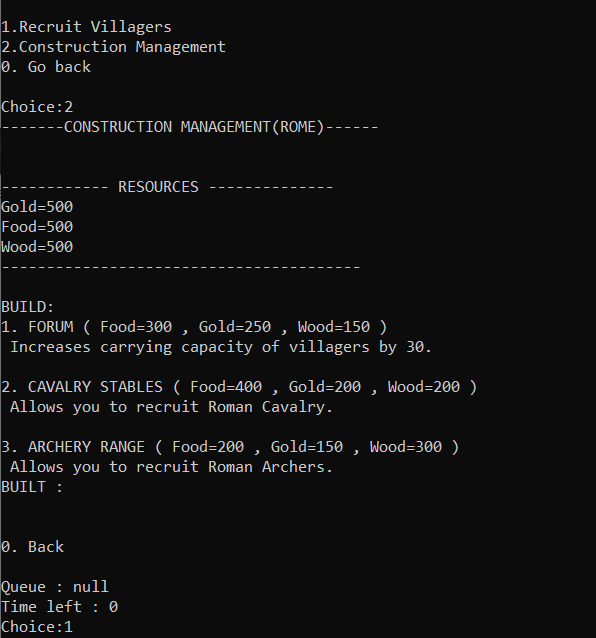
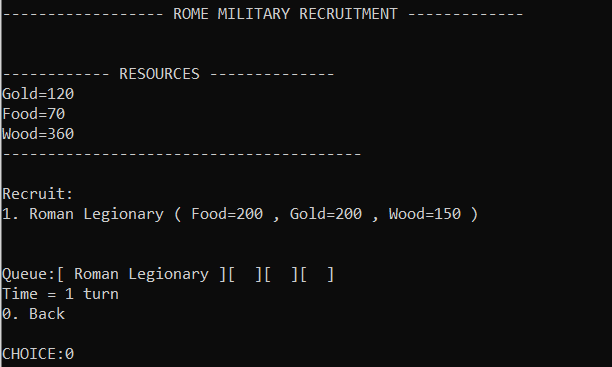
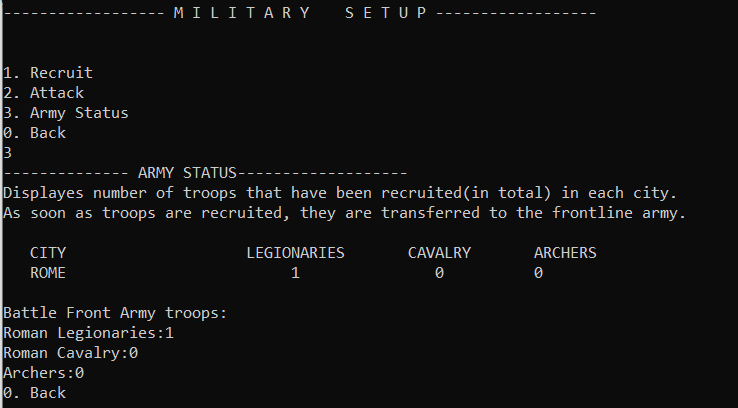
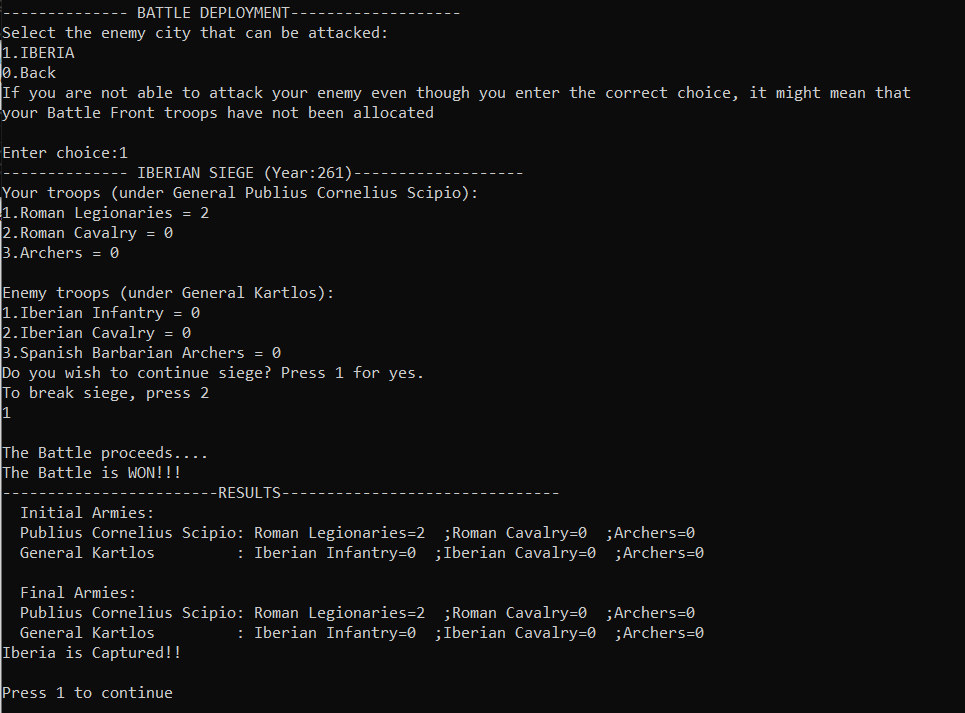

<p align="center"></p>

<h2 align="center">Kingdom Wars: The Punic Wars</h2>

<p align="center">   </p>

Kingdoms Wars is a turn-based strategy game created with Java. The game is loosely based on the Punic Wars.

## Goal :dart:
The game starts with you having one city, Rome, under your control and your aim is to control all the other 4 cities.

## How to install
First, clone this repository onto your computer and run the following commands in your cmd (command prompt):
```
javac KingdomWars.java
java KingdomWars
```
That's it! Enjoy the game!

## Screenshots

#### Game Map / Home Screen


#### :construction_worker: Villager Recruitment :construction_worker:


#### :moneybag: Villager Management :moneybag:


#### :pick: Construction Management :pick:


#### :shield: Military Recruitment :shield:


#### :shield: Military Setup :shield:


#### :dagger: Battle Deployment :dagger:

